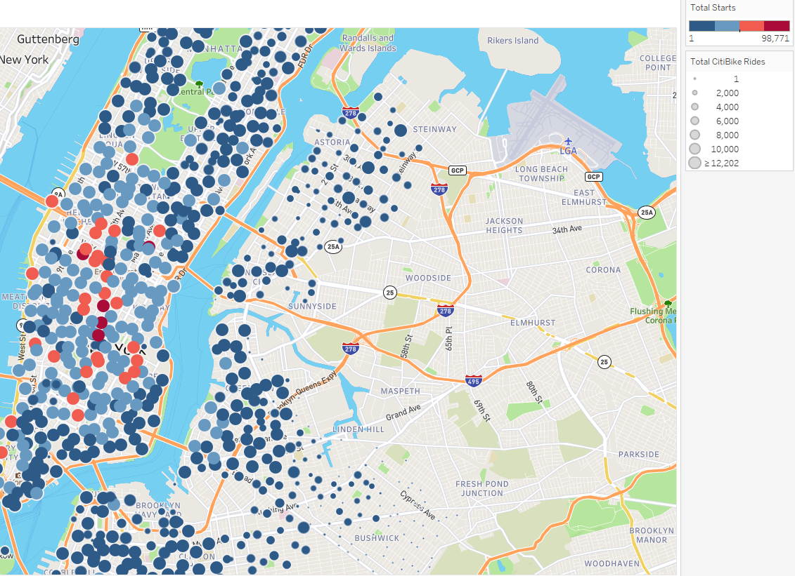
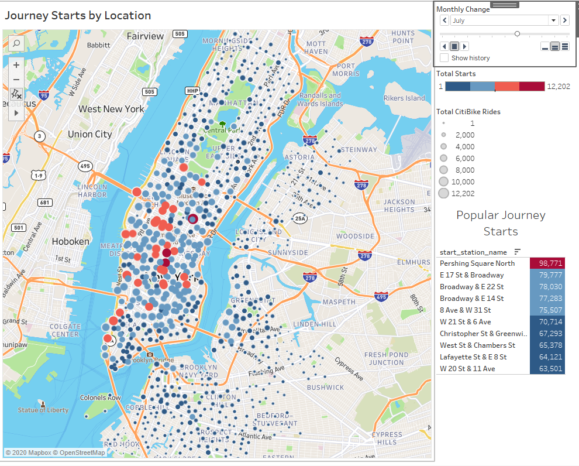
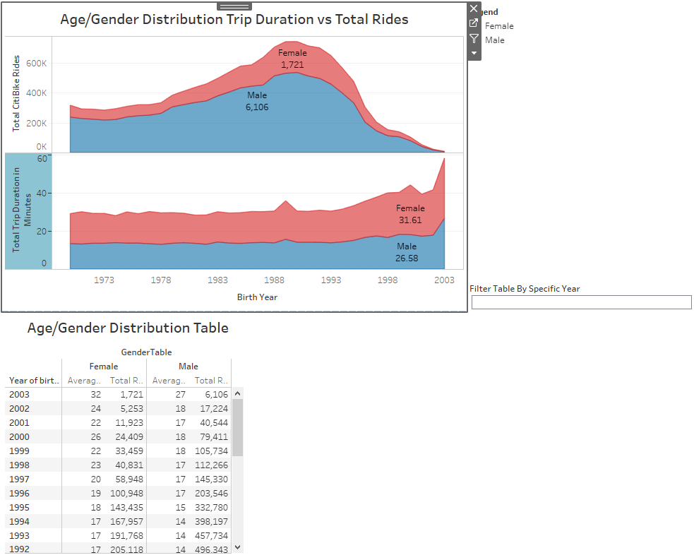
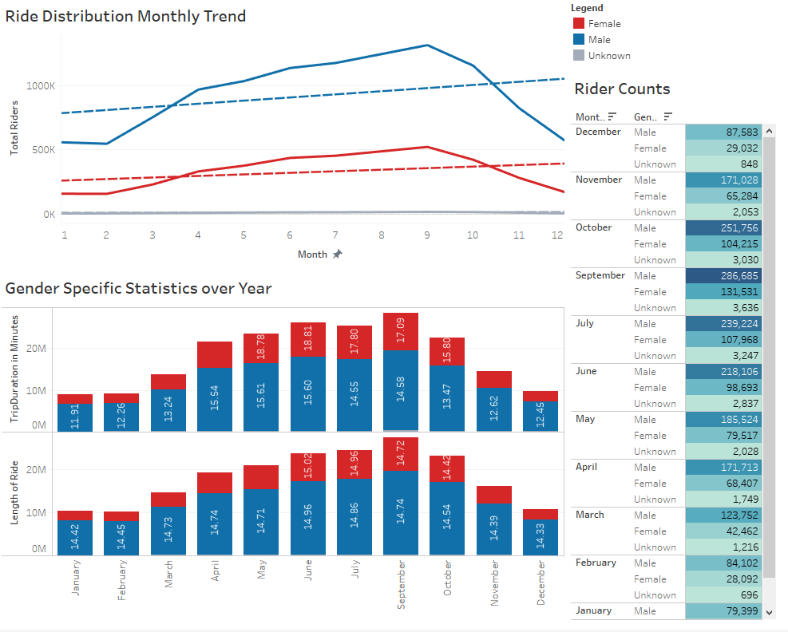
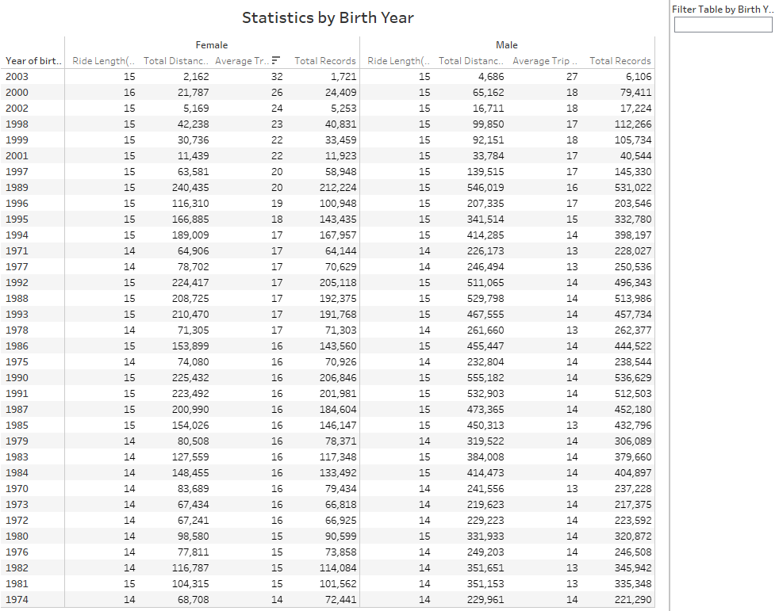
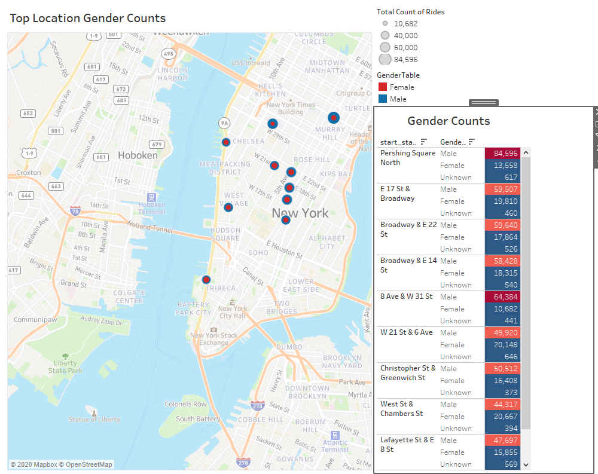
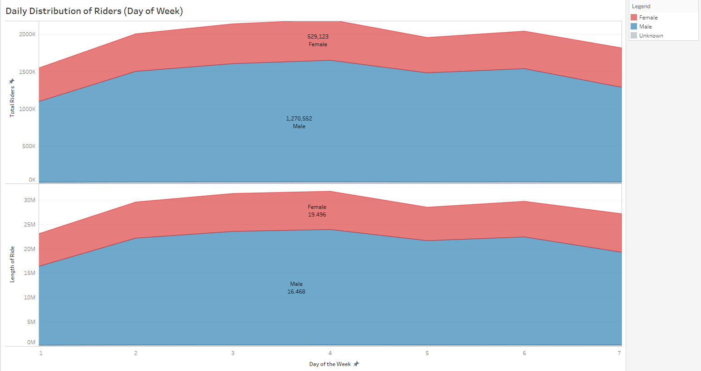
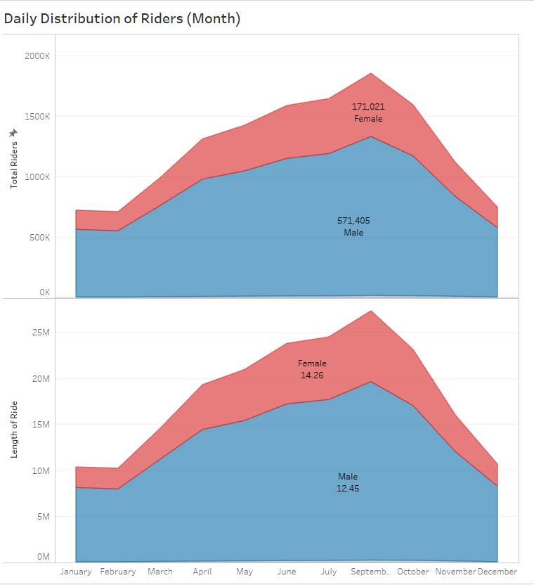

# Tableau_Citi_Bike_Analysis
[Visit the Full Tableau Workbook](https://public.tableau.com/profile/elie2805#!/vizhome/CitiBikeAnalysis_Dec2018-Nov2019/Story1?publish=yes)

This Project Focused on the analysis of Citibikes being utilized in New York City.

The primary factors that I focused on looking at was gender distribution with regards to the Top Locations to rent a CitiBike, and with overall usage factors such as average trip times on bike, average distance, and rider counts throughout New York City.

### Technologies Used:
*   PostgreSQL
*   Tableau Desktop Software
*   Python/Jupyter Notebook
*   [CitiBike Dataset Libraries](https://www.citibikenyc.com/system-data)

### About the Data Gathering

In Gathering the Data, I chose to pull data from December of 2018 to November 2019.  Each Dataset came with its own respective CSV, each containing over 150 to 200MB of Data.

After gathering the csv files, I had setup a PostgreSQL server with respective tables to hold the data from CSV imports.

When the Database was Ready, I established a connection straight to Tableau through PostgreSQL and began querying the database accordingly.

##  Analysis

First I started With Analyzing Geographically where there were CitiBike Rentals happening.  The following snapshot was including a page that showed the entire dataset over the year and showing the higher traffic areas with a dark red color.

I began to analyze month to month, to see the dynamic of the dispersal of the traffic.  The Follow is a snippet of the locations showing traffic for the month of July

In the following visualization, I started to get average stats for the gender distribution for the dataset.

## Monthly Trend Analysis

In this visualization I show the breakdown of the traffic that I observed by gender in the dataset.  It's no secret, As the nicer months would come, The # of rides would increase, but also the length of each trip would increase as well.  We do see a rise in female riders, however, there are more male riders that are contained in the dataset.

The following is a datatable showing the breakdown of statistics by Gender and Year of Birth.  This was to analyze closely to show relatively how many riders based on birthyear.

The Final Dashboard analysis is a heat map showing the ToP 10 Location Breakdown by Gender and Total Riders.  This visual serves to show geographically the amount of females to males renting CitiBikes.

##  Conclusions

Overall, CitiBikes are increasing on all levels.  Overall subscriber levels of men and women are increasing.  This Dataset held only most recent year, but it's ever increasing.

Does it differ based on days?  Very slightly.  
The Following visualization shows how the increase of risder starts in the month of April when spring begins and peaks the month of September.

As it begins to get colder, the data shows the colder weather lessens the time that the riders are riding and the number of riders.

